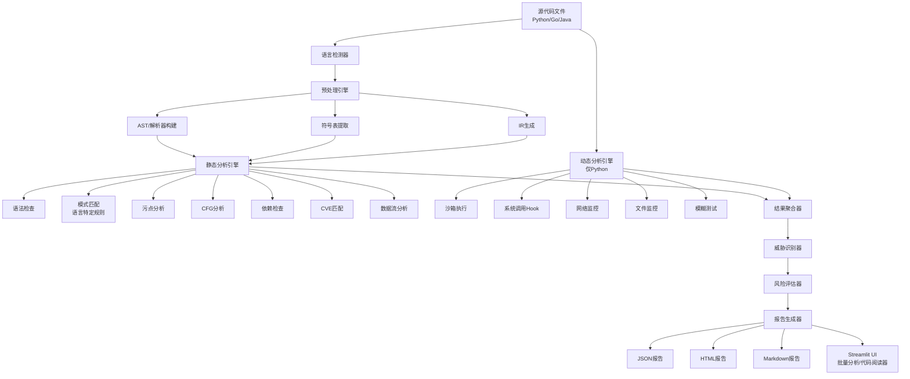

# OSS-Guardian

🛡️ **开源软件安全检测系统** - 多语言代码安全审计工具

## 项目简介

OSS-Guardian 是一个支持多语言（Python、Go、Java）的安全分析系统，通过静态分析和动态分析相结合的方式，检测代码中的安全漏洞和恶意行为。系统采用 AST（抽象语法树）分析、污点追踪、控制流分析、依赖检查等先进技术，能够识别 WebShell、SQL 注入、RCE、命令注入、CVE 漏洞等多种安全威胁。

### 核心特性

- 🌐 **多语言支持**
  - **Python**：完整的 AST 分析、污点追踪、CFG 分析
  - **Go**：语法检查、模式匹配、污点分析、依赖检查
  - **Java**：语法检查、模式匹配、污点分析、依赖检查

- 🔍 **静态代码分析**
  - 基于 AST 的语法树分析（Python）
  - 正则表达式模式匹配（支持语言特定规则）
  - 污点数据流追踪（追踪输入到敏感操作的路径）
  - 控制流图分析（识别异常流程）
  - **依赖检查**：自动提取并检查项目依赖
  - **CVE 匹配**：与已知漏洞数据库比对
  - **数据流分析**：完整的数据流路径追踪

- 🧪 **动态行为分析**
  - Windows 环境下的函数 Hook（Monkey Patch）
  - 系统调用监控（`os.system`, `subprocess`, `exec.Command`, `Runtime.exec` 等）
  - 网络活动检测（`socket.connect`, `net.Dial` 等）
  - **文件活动监控**：监控文件读写操作，检测敏感文件访问
  - 模糊测试（生成随机参数测试）
  - 内存分析框架（占位实现，未来扩展）

- 🎯 **威胁识别**
  - 自动识别 8+ 种威胁类型
  - 风险评分（0-100）
  - 详细证据链追踪
  - CVE 漏洞报告

- 📊 **报告生成**
  - JSON 格式报告（机器可读）
  - HTML 可视化报告（中文界面）
  - **Markdown 格式报告**（便于文档化）
  - 威胁详情和修复建议

- 🎨 **用户界面**
  - 现代化的 Streamlit Web 界面（灰蓝色主题）
  - **ZIP 文件上传**：支持批量分析整个项目
  - **多语言文件识别**：自动识别 Python、Go、Java 文件
  - **右侧代码阅读器**：威胁位置高亮，可隐藏/显示
  - 批量分析报告下载

### 技术特点

- ✅ **多语言支持**：Python、Go、Java 三种语言
- ✅ **完整 AST 分析**：Python 使用标准 AST，Go/Java 使用简化解析
- ✅ **依赖安全检查**：自动检查项目依赖的 CVE 漏洞
- ✅ **Windows 10/11 原生支持**
- ✅ **Monkey Patch 技术**：无需 strace，直接 Hook 函数调用
- ✅ **真实执行**：不造假数据，真实沙箱环境
- ✅ **现代化 UI**：美观的 Streamlit Web 界面，支持批量分析
- ✅ **代码阅读器**：右侧面板，威胁位置高亮显示

## 系统架构



## 快速开始

### 环境要求

- **Python 3.7+**
- **Windows 10/11**
- **2GB+ 可用内存**
- **可选**：Go 编译器（用于 Go 语法检查）
- **可选**：Java 编译器（用于 Java 语法检查）

### 安装步骤

1. **克隆或下载项目**

```bash
cd OSS-Guardain
```

2. **安装依赖**

```bash
pip install -r requirements.txt
```

3. **验证安装**

```bash
python main_controller.py tests/malware_demo.py
```

### 快速测试

使用命令行分析测试文件：

```bash
python main_controller.py tests/malware_demo.py
```

启动 Web 界面：

```bash
streamlit run app.py
```

然后在浏览器中打开显示的 URL（通常是 `http://localhost:8501`）

## 功能特性

### 静态分析功能

| 功能 | Python | Go | Java | 说明 |
|------|--------|----|----|------|
| 语法检查 | ✅ | ✅ | ✅ | Python 使用 `compile()`，Go 使用 `go build`，Java 使用 `javac` |
| 模式匹配 | ✅ | ✅ | ✅ | 基于正则表达式，支持语言特定规则（30+ 条规则） |
| 污点分析 | ✅ | ✅ | ✅ | 追踪输入源到危险函数的数据流 |
| CFG 分析 | ✅ | ⚠️ | ⚠️ | Python 完整支持，Go/Java 简化实现 |
| 符号提取 | ✅ | ✅ | ✅ | 提取函数、变量、导入、类等符号信息 |
| **依赖检查** | ✅ | ✅ | ✅ | 自动提取项目依赖（requirements.txt, go.mod, pom.xml 等） |
| **CVE 匹配** | ✅ | ✅ | ✅ | 与本地 CVE 数据库比对，识别已知漏洞 |
| **数据流分析** | ✅ | ⚠️ | ⚠️ | 完整的数据流路径追踪（Python 完整支持） |

### 动态分析功能

| 功能 | Python | Go | Java | 说明 |
|------|--------|----|----|------|
| 系统调用监控 | ✅ | ❌ | ❌ | Hook `os.system`, `subprocess`, `os.popen` 等（仅 Python） |
| 网络活动检测 | ✅ | ❌ | ❌ | 监控 `socket.connect`, `socket.bind` 调用（仅 Python） |
| **文件活动监控** | ✅ | ❌ | ❌ | 监控文件读写操作，检测敏感文件访问（仅 Python） |
| 沙箱执行 | ✅ | ❌ | ❌ | 在受控环境中运行目标代码（仅 Python） |
| 模糊测试 | ✅ | ❌ | ❌ | 生成随机参数测试代码健壮性（仅 Python） |
| 内存分析 | ⚠️ | ❌ | ❌ | 占位实现，未来扩展 |

**注意**：动态分析目前仅支持 Python。Go 和 Java 的动态分析需要不同的运行时监控技术，未来版本可能会支持。

### 威胁检测能力

系统能够检测以下威胁类型：

- **RCE (Remote Code Execution)** - 远程代码执行
  - Python: `os.system()`, `subprocess.*()`
  - Go: `exec.Command()`, `os/exec`
  - Java: `Runtime.exec()`, `ProcessBuilder`
- **Command Injection** - 命令注入
- **WebShell** - Web 后门（`eval()`, `exec()`, `__import__()` 等）
- **SQL Injection** - SQL 注入（字符串拼接、格式化等）
- **Backdoor** - 后门程序（硬编码密码、密钥、反向 Shell 等）
- **Network Exfiltration** - 网络数据泄露
- **File Operation Risk** - 文件操作风险（敏感文件访问、路径遍历等）
- **Runtime Vulnerability** - 运行时漏洞
- **CVE 漏洞** - 已知的第三方库漏洞（通过依赖检查）

### 报告生成功能

- **JSON 报告** - 机器可读的完整分析结果
- **HTML 报告** - 可视化报告（中文界面），包含风险评分、威胁列表、详细证据、CVE 信息
- **Markdown 报告** - 便于文档化和版本控制的报告格式
- **批量分析报告** - 支持多文件分析的汇总报告

## 使用方式

### 命令行使用

```bash
python main_controller.py <文件路径>
```

示例：

```bash
python main_controller.py tests/malware_demo.py
```

输出示例：

```
[INFO] Reading file: tests/malware_demo.py
[INFO] Building AST...
[INFO] Extracting symbols...
[INFO] Generating IR...
[INFO] Performing static analysis...
[INFO] Performing dynamic analysis...
[INFO] Aggregating results...
[INFO] Identifying threats...
[INFO] Assessing risk...
[INFO] Generating reports...
[SUCCESS] Analysis complete. Risk score: 85/100
```

### Web 界面使用

1. 启动应用：

```bash
streamlit run app.py
```

2. 在浏览器中打开显示的 URL（通常是 `http://localhost:8501`）

3. **上传文件**：
   - **单个文件**：上传 Python、Go 或 Java 文件
   - **ZIP 压缩包**：上传包含多个文件的 ZIP 压缩包，系统会自动识别支持的语言文件

4. **配置分析选项**：
   - 启用/禁用静态分析
   - 启用/禁用动态分析（仅 Python）

5. **查看分析结果**：
   - 风险评分和等级
   - 威胁列表和详细信息
   - CVE 漏洞报告
   - 依赖信息

6. **使用代码阅读器**：
   - 点击"查看源代码"按钮
   - 右侧面板显示代码，威胁位置高亮
   - 可点击威胁索引跳转到对应行
   - 可隐藏/显示面板

7. **下载报告**：
   - JSON、HTML、Markdown 格式
   - 批量分析支持汇总报告下载

### 配置说明

系统配置文件位于 `config/` 目录：

- **settings.yaml** - 系统配置（超时、路径、开关等）
- **rules.yaml** - 安全检测规则库

详细配置说明请参考 [USAGE.md](USAGE.md)

## 项目结构

```
OSS-Guardian/
├── app.py                          # Streamlit Web 界面
├── main_controller.py              # 业务总控流程（多语言路由）
├── requirements.txt                # 依赖列表
├── README.md                       # 项目说明文档
├── USAGE.md                        # 使用说明文档
├── config/
│   ├── settings.yaml               # 系统配置
│   └── rules.yaml                  # 安全规则库（支持多语言规则）
├── engines/
│   ├── preprocessing/               # 预处理引擎
│   │   ├── parser.py               # 文件读取
│   │   ├── language_detector.py    # 语言检测
│   │   ├── ast_builder.py          # Python AST 构建
│   │   ├── go_parser.py            # Go 语言解析器
│   │   ├── go_ast_builder.py       # Go AST 构建
│   │   ├── java_parser.py          # Java 语言解析器
│   │   ├── java_ast_builder.py     # Java AST 构建
│   │   ├── symbol_table.py        # 符号表提取
│   │   └── ir_generator.py        # IR 生成
│   ├── static/                     # 静态分析引擎
│   │   ├── syntax_checker.py       # Python 语法检查
│   │   ├── go_syntax_checker.py    # Go 语法检查
│   │   ├── java_syntax_checker.py  # Java 语法检查
│   │   ├── pattern_matcher.py      # 模式匹配
│   │   ├── taint_analysis.py       # Python 污点分析
│   │   ├── go_taint_analysis.py    # Go 污点分析
│   │   ├── java_taint_analysis.py  # Java 污点分析
│   │   ├── cfg_analysis.py         # CFG 分析
│   │   ├── dependency_checker.py # 依赖检查
│   │   ├── cve_matcher.py          # CVE 匹配
│   │   └── dataflow_analysis.py    # 数据流分析
│   ├── dynamic/                    # 动态分析引擎
│   │   ├── sandbox.py              # 沙箱执行
│   │   ├── syscall_monitor.py      # 系统调用监控（含文件监控）
│   │   ├── network_monitor.py      # 网络监控
│   │   ├── file_monitor.py         # 文件活动监控
│   │   ├── memory_analyzer.py     # 内存分析（占位）
│   │   └── fuzzer.py               # 模糊测试
│   └── analysis/                   # 结果分析引擎
│       ├── aggregator.py           # 结果聚合
│       ├── threat_identifier.py    # 威胁识别
│       ├── risk_assessor.py        # 风险评估
│       └── report_generator.py     # 报告生成（JSON/HTML/Markdown）
├── data/
│   ├── uploads/                    # 上传文件目录
│   ├── intermediate/                # 中间结果目录
│   ├── logs/                       # 日志文件目录
│   ├── reports/                    # 报告输出目录
│   └── cve_database.json           # CVE 漏洞数据库
└── tests/
    ├── malware_demo.py             # 基础测试用例
    └── test_comprehensive.py       # 综合测试用例
```

## 开发信息

### 技术栈

- **Python 3.7+** - 核心语言
- **AST** - 抽象语法树分析（Python）
- **正则表达式** - 模式匹配和代码解析（Go/Java）
- **Streamlit** - Web UI 框架
- **PyYAML** - 配置文件解析
- **Monkey Patch** - 动态 Hook 技术（Python）
- **zipfile** - ZIP 文件处理
- **subprocess** - 外部命令调用（Go/Java 语法检查）

### 开发规范

- 所有代码必须基于 AST 真实处理，禁止使用占位代码
- 所有函数必须包含完整的文档字符串
- 错误处理必须完善
- 代码必须通过语法检查

### 贡献指南

1. Fork 本项目
2. 创建特性分支
3. 提交更改
4. 推送到分支
5. 创建 Pull Request

## 许可证

本项目为课程设计项目，仅供学习和研究使用。

## 联系方式

如有问题或建议，请提交 Issue。

---

**注意**：本系统仅用于安全研究和教育目的。请勿用于非法用途。
